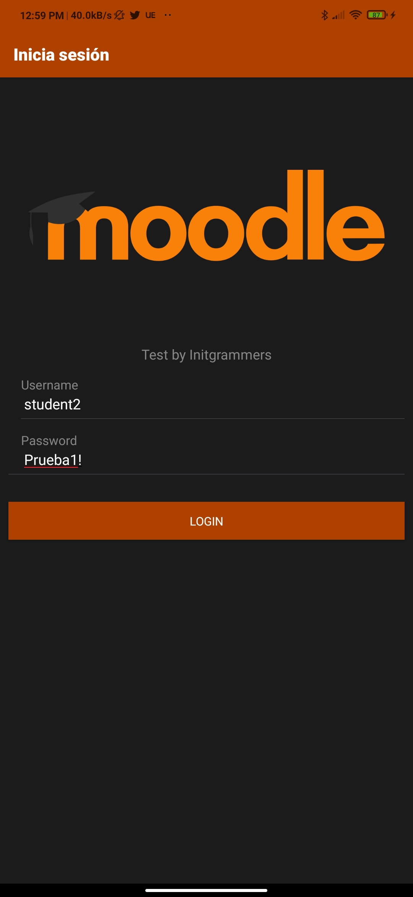
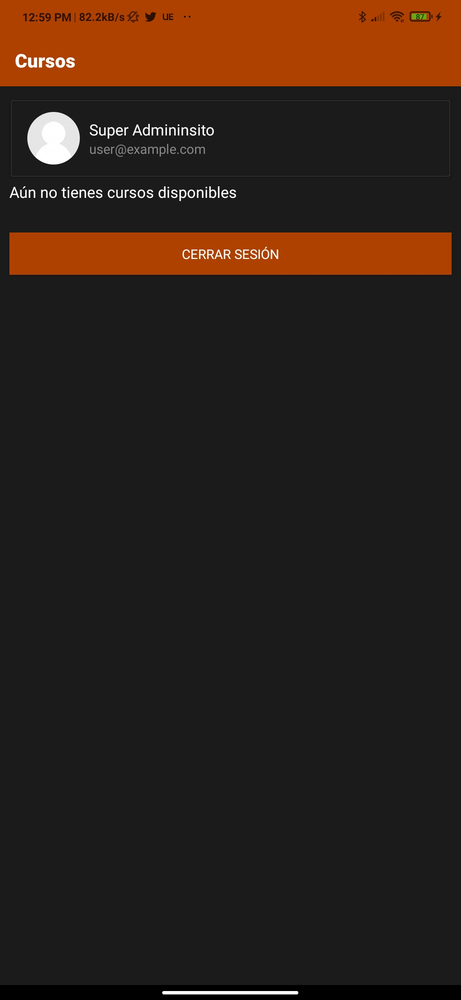
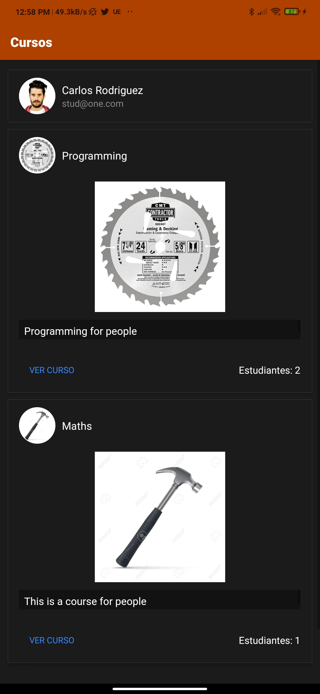
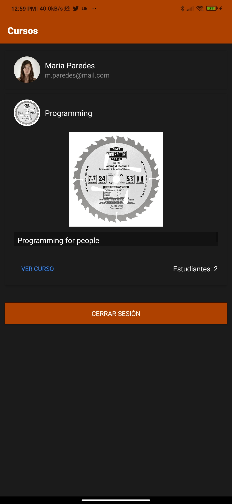
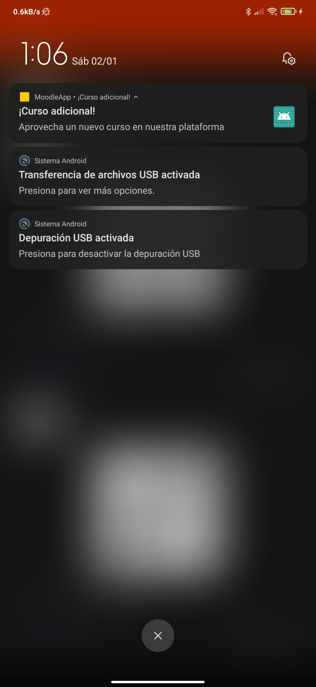

# Moodle App 

This project is a test with moodle and web services.

[Web services Moodle Docs](https://docs.moodle.org/dev/Web_service_API_functions)
# Content

- Auth Flow 
- View Courses 
- Push notifications with FCM and Firebase
- Redux 

# How to run 
- Go to Firebase console and get `google-services.json` 
- Copy and paste `google-services.json` on `android/app`
- Install dependencies `yarn`
- Install pods `npx pod install`
- Run android or ios

# **Screenshots**
## Signin

## Admin 

# Notifications

